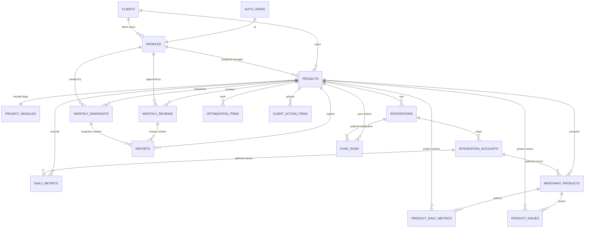

# Database Schema V1

This document describes the Phase 2 Supabase schema and Row Level Security foundation for the KonverzióHuszár Ügyfélportál V1. The source of truth remains `CODEX_MASTER_SPEC_KONVERZIOHUSZAR_V1.md`.

## Migration Order

1. `20260801182000_create_core_schema.sql`
   - Creates extensions, enum types, tables, constraints, indexes, and the shared `updated_at` trigger.
2. `20260801182100_create_rls_helpers.sql`
   - Creates reusable RLS helper functions:
     - `is_agency_admin()`
     - `current_client_id()`
     - `can_access_project(project_uuid)`
3. `20260801182200_enable_rls_and_policies.sql`
   - Grants explicit Data API access to `authenticated` and `service_role`.
   - Revokes table access from `anon`.
   - Enables RLS on all V1 data tables.
   - Creates agency-admin and client-user policies.
4. `supabase/seed.sql`
   - Development-only seed data.
   - Not a production migration.
   - Must not be run against production.

## Table Descriptions

| Table | Description |
| --- | --- |
| `profiles` | Application profile linked to `auth.users`; stores role, client ownership, and active state. |
| `clients` | Commercial client/company tenant. |
| `projects` | One webshop, market, country, or reporting unit under a client. |
| `project_modules` | Project-level visibility flags for V1 modules. |
| `integrations` | Project integration status per provider; does not store credentials. |
| `integration_accounts` | External account mappings under an integration; stores metadata only, not secrets. |
| `daily_metrics` | Normalized daily project/channel metrics. |
| `monthly_snapshots` | Versioned monthly reporting snapshots. |
| `monthly_reviews` | Draft and approved monthly written summaries, outcomes, corrective actions, and next-month plans. |
| `optimization_items` | Agency work items: planned, current, completed, or cancelled. |
| `client_action_items` | Client-facing actions, primarily Merchant Center/feed tasks. |
| `merchant_products` | Merchant Center product records and feed metadata. |
| `product_daily_metrics` | Daily product-level performance metrics. |
| `product_issues` | Merchant/feed/product issues and recommendations. |
| `reports` | Monthly report records and PDF storage paths. |
| `sync_runs` | Internal integration/background job run history. |

## Relationship Diagram



## RLS Model

RLS is enabled on every V1 data table:

- `profiles`
- `clients`
- `projects`
- `project_modules`
- `integrations`
- `integration_accounts`
- `daily_metrics`
- `monthly_snapshots`
- `monthly_reviews`
- `optimization_items`
- `client_action_items`
- `merchant_products`
- `product_daily_metrics`
- `product_issues`
- `reports`
- `sync_runs`

The model uses three reusable helper functions:

- `is_agency_admin()`
  - Returns true for active `agency_admin` profiles.
  - Used for broad agency management policies.
- `current_client_id()`
  - Returns the active user's `client_id`.
  - Used for tenant-scoped client/project reads.
- `can_access_project(project_uuid)`
  - Returns true for agency admins or client users whose `client_id` owns the project.
  - Used for project-scoped reads.

The helper functions are `SECURITY DEFINER` because they must read `profiles` and `projects` without recursive RLS policy calls. Each function sets `search_path = public, pg_temp`, has public execution revoked, and is granted only to `authenticated` and `service_role`.

## Access Examples

Agency admin:

- Can read and write every V1 table through admin policies.
- Can create/edit clients, projects, monthly reviews, reports, integrations, and internal sync records.
- Can approve monthly reviews and client-visible content.

Client user:

- Can read only their own `profiles` row.
- Can read only their own `clients` row.
- Can read only projects where `projects.client_id = current_client_id()`.
- Can read project modules for accessible projects.
- Can read project metrics for accessible projects.
- Can read only final monthly snapshots.
- Can read only approved/published monthly reviews with approved summary text.
- Can read only approved and visible optimization items.
- Can read visible client action items.
- Can read visible Merchant products and product issues.
- Can read approved/generated/published reports for accessible projects.
- Cannot modify agency content.
- Cannot access another client's project data.
- Cannot see draft or hidden monthly reviews, optimization items, client action items, product issues, or hidden Merchant products.
- Cannot read integration account mappings or sync run internals.

Anonymous user:

- Has no table grants in the Phase 2 schema.

Service role:

- Has explicit grants for server-side operations.
- Must never be exposed in browser code.

## Security Notes

- No secrets are stored in the database migrations.
- Windsor.ai credentials are intentionally absent from this schema and must remain server-side when implemented later.
- `anon` table access is explicitly revoked.
- `authenticated` receives table-level grants because both agency admins and client users use the same Postgres role; RLS policies define the real authorization boundary.
- The schema avoids broad `to authenticated using (true)` policies.
- The schema avoids `auth.role()` and uses the policy `TO` clause.
- RLS helper functions use `(select auth.uid())` and are wrapped in policy calls for better policy performance.
- No production seed data is included.

## Known Limitations

- The migrations are not applied to a remote Supabase project yet.
- Local Supabase validation requires Docker Desktop or Podman to be installed and available on `PATH`.
- Client users cannot read `integrations`, `integration_accounts`, or `sync_runs` directly. Future client-facing refresh status should be exposed through safe derived data or server-side view models.
- `supabase/seed.sql` includes a commented agency admin profile placeholder because `profiles.id` must reference a real local `auth.users` row.
- No generated TypeScript database types are included yet.
- No authentication UI or protected route logic is implemented in this phase.
- No Windsor.ai integration or background jobs are implemented in this phase.

## Local Verification

The repository includes pgTAP verification scripts:

```text
supabase/tests/schema_v1.sql
supabase/tests/seed_v1.sql
supabase/tests/rls_v1.sql
```

Run them after starting the local stack and resetting the database:

```bash
supabase start
supabase db reset
supabase test db --local supabase/tests
supabase db lint --local --schema public,auth --fail-on error
supabase db advisors --local --type all --level info --fail-on error
```

## Applying Migrations Later

Do not apply these migrations to production until Phase 2 review is complete.

Recommended later workflow:

1. Install or authenticate the Supabase CLI.
2. Verify CLI commands with:
   ```bash
   supabase --help
   supabase db --help
   supabase migration --help
   ```
3. Start a local Supabase stack if available:
   ```bash
   supabase start
   ```
4. Apply migrations locally:
   ```bash
   supabase db reset
   ```
5. Inspect local schema and run RLS/advisor checks:
   ```bash
   supabase db advisors
   supabase migration list --local
   ```
6. Run `supabase/seed.sql` only in a development environment, after creating a matching local Supabase Auth user for the agency admin placeholder if needed.
7. Apply to a remote project only after review and explicit approval:
   ```bash
   supabase db push
   ```
