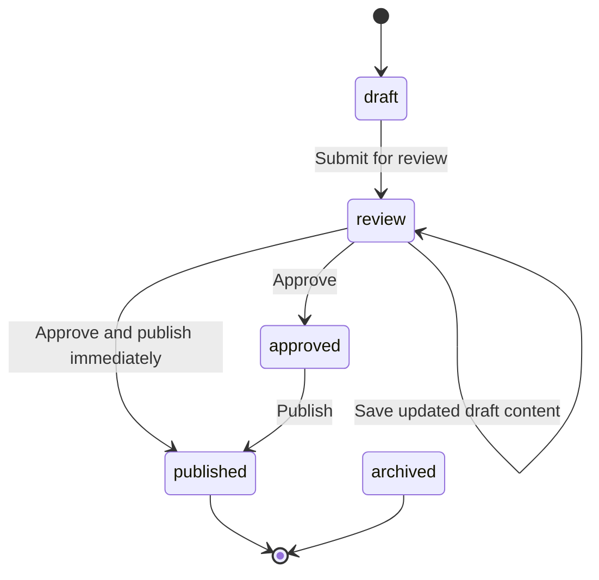

# Monthly Communication Workflow V1

This document describes the completed Phase 7 monthly communication workflow for the KonverzioHuszar client portal. Product behavior remains governed by `CODEX_MASTER_SPEC_KONVERZIOHUSZAR_V1.md`.

## Scope

Phase 7 turns the monthly communication area from read-only dashboard content into an agency-managed workflow while preserving the approved portal UI and Phase 6 read path.

Implemented scope:

- Agency-only monthly review editor.
- Agency-only approval and publishing workflow.
- Agency-only optimization item management.
- Agency-only client action item management.
- Client read path for approved, published, and visible content.
- Deterministic staging-only monthly communication fixture.
- Regression tests for permissions, validation, state transitions, UI behavior, and RLS visibility.

Out of scope:

- Windsor.ai live calls.
- AI-generated monthly copy.
- PDF report generation.
- Merchant Center deep-dive pages.
- Production seed data.
- Hosted production database changes.
- Automatic report revision workflow.

## Data Model

Phase 7 uses the existing V1 tables created in Phase 2:

| Table | Workflow role |
| --- | --- |
| `monthly_reviews` | Stores monthly draft text, approved client-facing text, outcome items, corrective actions, next-month plan, status, and approval metadata. |
| `optimization_items` | Stores agency work items with status, approval status, and client visibility. |
| `client_action_items` | Stores client-facing action requests using the existing item status workflow. |
| `profiles` | Provides agency admin identity for permission checks and `approved_by`. |
| `projects` | Provides the selected project context and tenant boundary. |
| `clients` | Provides client ownership through project scoping and RLS. |

No new tables or migrations were introduced in Phase 7.

## Server-Side Architecture

Monthly communication mutations are server-side only:

| Layer | Files | Responsibility |
| --- | --- | --- |
| Server actions | `app/(portal)/monthly-review-actions.ts` | Read authenticated user, create server Supabase client, call service functions, translate validation errors to Hungarian UI states, and revalidate the portal route. |
| Monthly review service | `lib/monthly-communication/service.ts` | Enforce agency-only access, validate Zod input, enforce state transitions, preserve approved history, and require corrective actions for focus outcomes. |
| Monthly review repository | `lib/monthly-communication/repository.ts` | Load and write `monthly_reviews` records through the server Supabase client. |
| Work management service | `lib/monthly-communication/work-management.ts` | Enforce agency-only access and normalize optimization/client-action writes. |
| Work management repository | `lib/monthly-communication/work-management-repository.ts` | Load and write `optimization_items` and `client_action_items`. |
| View models | `lib/monthly-communication/*view-model.ts` | Build agency editor, approval, and work-management UI models from the selected accessible project. |
| Components | `components/monthly-communication/*.tsx` | Render Hungarian UI, loading/error/validation states, and accessible controls. |

Client-side components never receive a service-role key and never bypass server-side permission checks.

## Permissions

### Agency Admin

An agency admin can:

- open the monthly review editor for the selected accessible project,
- save a monthly review draft,
- submit a draft for review,
- approve review-state content,
- publish already approved content,
- create or update optimization items,
- create or update client action items,
- decide whether approved optimization items are client-visible.

Agency admin requirements:

- authenticated Supabase user,
- active `profiles` row,
- `role = agency_admin`,
- selected project must be in the server-loaded accessible project list.

### Client User

A client user can:

- read the dashboard for their own client/project,
- read approved or published monthly review content,
- read approved and client-visible optimization items,
- read visible client action items.

A client user cannot:

- access the monthly editor,
- save drafts,
- approve or publish content,
- edit optimization items,
- edit client action items,
- read another client's project data,
- read draft or review monthly reviews,
- read hidden optimization items,
- read draft or hidden client action items.

Authorization is enforced in two layers:

- server-side route/action checks using the authenticated current user and accessible project context,
- PostgreSQL RLS policies on the underlying project/client data tables.

Frontend state is not treated as an authorization boundary.

## Monthly Review State Transitions

The `monthly_reviews.status` workflow is intentionally narrow:

Allowed transitions:

| From | To | Who | Requirements |
| --- | --- | --- | --- |
| missing | `draft` | agency admin | Valid project, period, draft summary, outcome items, and next-month plan. |
| `draft` | `draft` | agency admin | Draft content can be edited while not approved. |
| `review` | `draft` write payload | agency admin | Saving through the draft form can update review-state draft content before approval. |
| `draft` | `review` | agency admin | Draft summary, outcome items, corrective actions, and next-month plan must validate. |
| `review` | `approved` | agency admin | Approved summary is required; `approved_by` and `approved_at` are recorded. |
| `review` | `published` | agency admin | Same approval requirements, plus immediate publish flag. |
| `approved` | `published` | agency admin | Existing `summary_approved`, `approved_by`, and `approved_at` must be present. |

Blocked transitions:

| Blocked action | Reason |
| --- | --- |
| Client user mutation | Only active agency admins can manage monthly communication content. |
| Saving over `approved`, `published`, or `archived` as a draft | Approved historical content is protected from accidental overwrite. |
| Publishing `draft` or `review` directly | Content must be approved before publishing. |
| Approving non-`review` content | Approval is only valid for content waiting for review. |
| Publishing focus outcome without corrective actions | Weak/focus communication must include a concrete corrective action. |
| Publishing without approved metadata | `approved_by` and `approved_at` are mandatory before client-visible publication. |

## Validation Rules

Monthly review draft validation uses Zod:

- `projectId` must be a UUID.
- `periodStart` and `periodEnd` must be valid `YYYY-MM-DD` calendar dates.
- `periodStart` must be before or equal to `periodEnd`.
- `summaryDraft` is required.
- `outcomeType` is `positive`, `mixed`, or `focus`.
- `outcomeItems` requires at least one item.
- Negative outcome items require an explanation or corrective action.
- `nextMonthPlan` requires at least one item.
- `focus` outcomes require at least one corrective action.

Approval validation:

- `reviewId` must be a UUID.
- approved summary text is required.
- `publishImmediately` defaults to `false`.
- stored outcome JSON, corrective actions, and next-month plan must still parse before approval or publication.

Work management validation:

- optimization item category, status, approval status, visibility, and dates are validated server-side,
- draft or hidden optimization items are forced to `is_client_visible = false`,
- client action visibility maps to the stored status workflow,
- draft or hidden client action items cannot have `resolved_at`.

## UI Behavior

Agency admins see the monthly communication tools below the overview:

- monthly summary editor,
- approval/publish workflow,
- current/completed work management,
- client action management.

Client users do not see agency editor tools. They see only the client-safe dashboard read model already documented in `docs/dashboard-read-path-v1.md`.

All visible UI text is Hungarian. Error and validation states are translated before being shown in the UI.

## Staging Fixture

The Phase 7 staging-only fixture is documented in `docs/staging-monthly-communication-fixtures.md`.

Fixture files:

| File | Purpose |
| --- | --- |
| `supabase/fixtures/staging-monthly-communication-demo.sql` | Idempotently applies deterministic monthly communication demo content to the existing staging client/project. |
| `supabase/fixtures/staging-monthly-communication-demo.verify.sql` | Verifies counts, status rules, approval metadata, corrective actions, and client-user RLS visibility. |
| `supabase/fixtures/staging-monthly-communication-demo.rollback.sql` | Deletes only the deterministic fixture records by approved fixture IDs. |
| `supabase/fixtures/staging-monthly-communication-demo.verify-rollback.sql` | Verifies that rollback removed the fixture records. |

Hosted staging target:

| Item | Value |
| --- | --- |
| Supabase project | `kh-dashboard-staging` |
| Project ref | `shspxmmdzuxbwxqdugoa` |
| Client slug | `kh-staging-client` |
| Project slug | `kh-staging-hu` |

The fixture creates deterministic demo records for:

- one `draft` monthly review,
- one `review` monthly review,
- one `approved` monthly review,
- one `published` monthly review,
- one hidden and one visible optimization item,
- one draft and one visible client action item.

The fixture was applied to staging only after explicit approval. It was also re-run idempotently to restore deterministic demo content after manual smoke-test edits.

## Staging Smoke Result

Phase 7 staging validation completed successfully on the staging environment:

- agency admin login worked,
- agency admin could access the protected overview,
- agency admin project selection was activated and merged through the follow-up fix,
- monthly communication fixture content was restored to deterministic demo data,
- client user login worked,
- client user dashboard read path stayed scoped to the staging client/project,
- client user could read approved/published monthly review content,
- client user could not read draft/review monthly reviews,
- client user could read approved visible optimization content,
- client user could not read hidden optimization content,
- client user could read visible client actions,
- client user could not read draft client actions.

Latest explicit client-user RLS verification after fixture restore:

| Check | Result |
| --- | --- |
| Draft/review monthly reviews visible | `0` |
| Approved/published monthly reviews visible | `2` |
| Non-client monthly review statuses visible | `0` |
| Approved visible optimization items visible | `1` |
| Hidden optimization items visible | `0` |
| Draft client actions visible | `0` |
| Visible client actions visible | `1` |

## Tests

Phase 7 coverage includes:

- monthly communication Zod schema tests,
- agency-only mutation tests,
- invalid transition tests,
- approval metadata tests,
- focus/corrective-action enforcement tests,
- protected published-history behavior,
- editor UI tests,
- approval/publishing UI tests,
- work management UI and service tests,
- client-user visibility tests through the staging fixture verification SQL.

The Phase 7 closeout validation before this documentation PR:

- hosted staging fixture apply: passed on `shspxmmdzuxbwxqdugoa`,
- hosted staging fixture verify: passed on `shspxmmdzuxbwxqdugoa`,
- client-user RLS visibility query: passed,
- production Supabase untouched,
- Vercel configuration untouched,
- no manual deployment triggered.

## Rollback

Code rollback:

- Revert the Phase 7 squash commits or deploy a previous known-good `main` commit.
- No Phase 7 schema migration exists, so there is no database migration rollback for the workflow implementation.

Staging fixture rollback:

- Use `supabase/fixtures/staging-monthly-communication-demo.rollback.sql` only after explicit approval.
- Run `supabase/fixtures/staging-monthly-communication-demo.verify-rollback.sql` afterward.
- Rollback deletes only deterministic fixture IDs and does not touch Auth users.

Operational rollback:

- If a monthly review is accidentally approved or published in staging, re-run the deterministic fixture apply SQL after approval to restore demo content.
- For production, do not overwrite published historical content. Create a reviewed revision workflow before changing already published client communication.

## Known Limitations and Follow-Ups

- Phase 7 does not add AI draft generation.
- Phase 7 does not add PDF report generation.
- Phase 7 does not add Merchant Center deep-dive management.
- Published historical content is protected from the current draft editor, but a formal revision/audit workflow is still a later concern.
- Full browser E2E automation for the editor workflow is not yet included.
- Phase 8 must not weaken monthly communication RLS or client visibility rules when Merchant Center pages are expanded.
